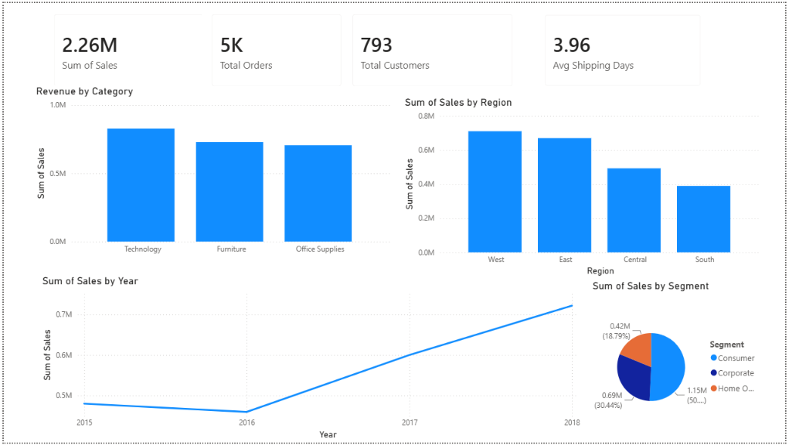

# Retail Sales Analytics Dashboard

## Project Overview

This project analyzes 9,800 retail transactions from a global superstore dataset using Python, Pandas, and Power BI.

The objective was to identify revenue drivers, customer behavior patterns, regional performance, and sales trends.

---

## Tools Used

* Python
* Pandas
* Google Colab
* Power BI
* GitHub

---

## Key Business Questions

* Which product categories generate the most revenue?
* Which regions contribute the highest sales?
* Which customer segments drive business growth?
* How have sales changed over time?
* What seasonal patterns exist?

---

## Key Insights

### Revenue by Category

* Technology generated the highest revenue (~$827K).

### Regional Performance

* West region was the top-performing region (~$710K).

### Customer Segments

* Consumer customers contributed over 50% of total revenue.

### Sales Growth

* Revenue increased from approximately $480K in 2015 to $722K in 2018.

### Seasonality

* Sales peaked consistently during Q4.

---

## Dashboard

Dashboard screenshot:

---

## Project Files

* Retail_Sales_Analysis.ipynb
* Retail_Sales_Dashboard.pbix
* dashboard.png

